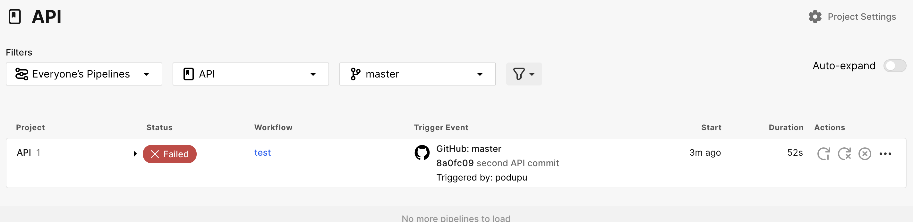

# Petstore API Testing

#CI/CD
[CircleCI](https://app.circleci.com/pipelines/circleci/QmhhSZw4MHEYrcV7zaF5La/D9wuaMemB4RiAqLfqVAg1P?branch=master)

#Report
[https://output.circle-artifacts.com/output/job/c38bb55a-93a9-448b-9916-5f7b0c8e3474/artifacts/0/cypress-reports/mochawesome.html]

## Overview
This project contains automated tests for the Petstore API using Cypress and TypeScript.

## Technologies Used
- Cypress
- TypeScript

## Prerequisites
- Node.js (>= 16.x)
- npm (>= 6.x)

## Installation
1. Clone the repository.
2. Run `npm install` to install dependencies.

## Running Tests
- Run all tests: `npm test`
- Open Cypress Test Runner: `npm run test:open`

## Project Structure
- **cypress/e2e/api-tests**: Contains API test cases.
- **cypress/support**: Custom commands and setup.
- **cypress/plugins**: Cypress plugins configuration.

## Reporting Issues
Please refer to the `BUGREPORT.md` file for the bug reporting template.
